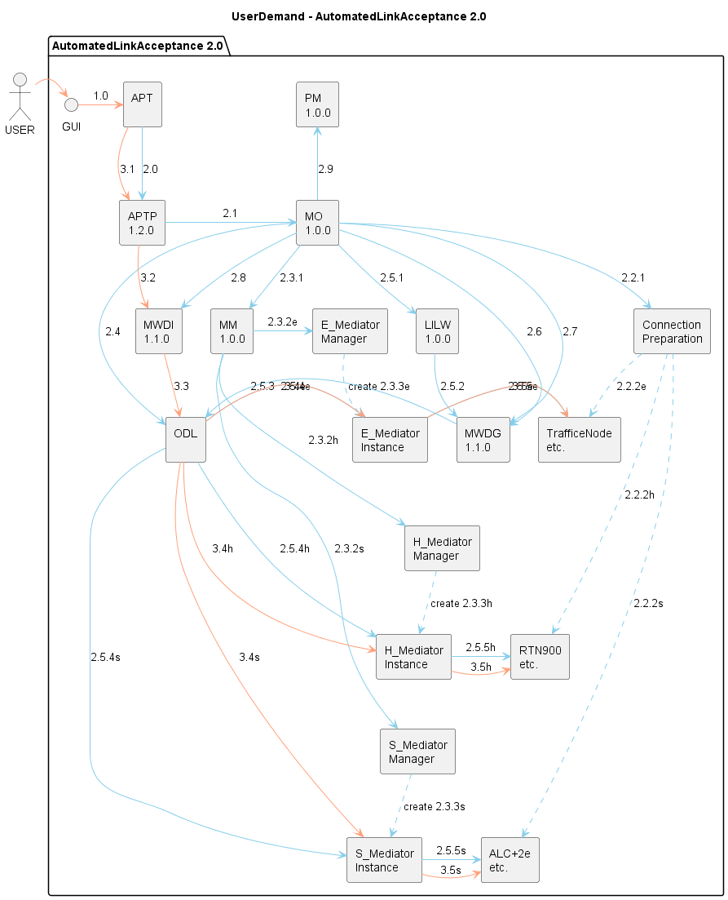
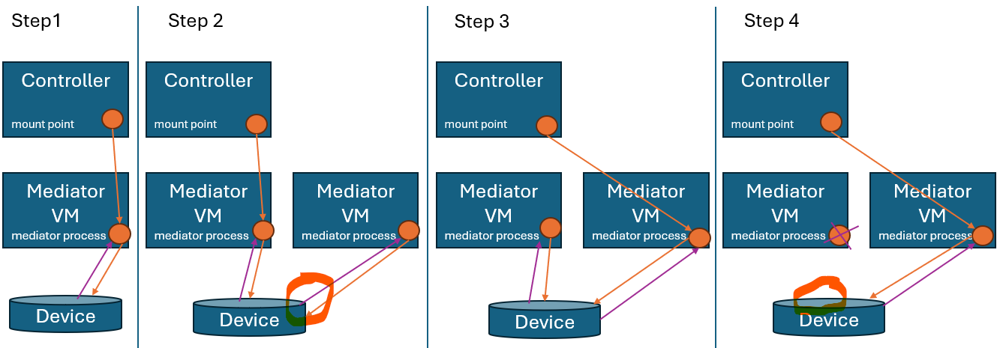
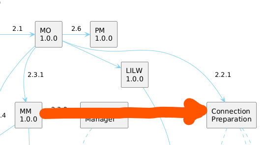
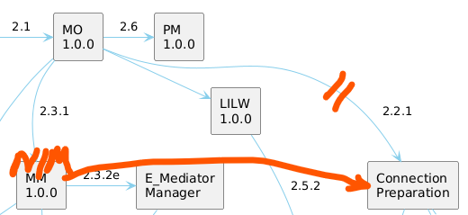

# Status

The former structuring of the AutomatedMounting ...

  

... implements a linear process.  

Example steps in this process:  
- prepare device  
- create mediator  
- create mount point at controller  
- ...  

It fulfils a single purpose: Make a REST interface available for a new device.  

During discussing the MediatorManager, we saw that further function would be reasonable:  
- Support of non-traffic-affecting mediator update  
but the discussion about using load sharing for supporting a non-traffic-affecting mediator update has stopped as we saw that configuration on the device would be required, too.  
  

- Device configuration hygiene    
need for a separate application for cleaning up SDN configurations on the device has been documented into the roadmap  

# Doubts

We stopped the discussion about the load sharing due to concerns about the complexity of configuring the device.  
In retrospective, this is hard to understand, because  
- we are already doing the exact same configuration with the ConnectionPreparation application  
- the existing script based solution are obviously imperfect as they are leaving a lot of obsolete configuration artifacts behind  
- we already documented the need for additional configuring on the devices (cleaning up SDN configurations)  

So, why not using the ConnectionPreparation for creating another SDN user on the device while balancing the load?  
The ConnectionPreparation application could be equipped with services for deleting obsolete users, too.  
  
Two applications, which are on the same level in the mounting process, but exchanging lateral requests, are causing first doubts on the architecture.  

Functions for creating a new mediator on the least occupied VM, load balancing on the mediator VMs and cleaning up SDN configurations on the devices are all requiring an up-to-date list of the mediator processes and their status.  
Separating functions that are operating on the same data into multiple applications, is increasing doubts on the architecture.  

# New Idea  

The current MediatorManager that is providing mediators could be expanded to a NetconfInterfaceManager providing and maintaining NetconfInterfaces.  
It would manage the device configuration, too.  
  

Connecting new devices, load balancing existing devices, cleaning the device configuration would be managed by the same application.  
